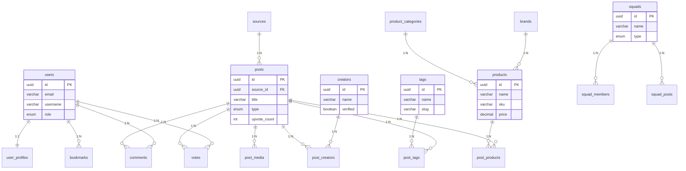

# GearVN Content Hub - Entity Relationship Diagram

## Full ERD Diagram

```mermaid
erDiagram
    %% ============================================
    %% USERS & AUTHENTICATION
    %% ============================================
    users ||--|| user_profiles : "has"
    users ||--|| user_preferences : "has"
    users ||--|| streaks : "has"
    users ||--|| user_levels : "has"
    users ||--o{ comments : "creates"
    users ||--o{ notifications : "receives"
    users ||--o{ user_points : "earns"
    users ||--o{ votes : "casts"
    users ||--o{ bookmarks : "saves"
    users ||--o{ follows : "follows (as follower)"
    users ||--o{ follows : "followed by (as followee)"
    users ||--o{ squad_members : "joins"
    users ||--|| squads : "creates"
    users ||--o{ user_achievements : "earns"

    users {
        uuid id PK
        varchar email UK
        varchar password_hash
        varchar username UK
        enum role "user|creator|admin"
        enum status "active|banned|pending"
        timestamp email_verified_at
        timestamp created_at
        timestamp updated_at
    }

    user_profiles {
        uuid user_id PK_FK
        varchar display_name
        varchar avatar_url
        text bio
        varchar website
        varchar location
        int total_upvotes_received
        int total_posts_created
        timestamp updated_at
    }

    user_preferences {
        uuid user_id PK_FK
        enum theme "dark|light"
        varchar language
        boolean email_notifications
        boolean push_notifications
        timestamp updated_at
    }

    %% ============================================
    %% CREATORS
    %% ============================================
    creators ||--o{ creator_socials : "has"
    creators ||--o{ post_creators : "authors"
    creators ||--o{ follows : "followed by users"

    creators {
        uuid id PK
        varchar name
        varchar slug UK
        varchar avatar_url
        text bio
        varchar website
        boolean verified
        int total_followers
        int total_posts
        timestamp created_at
        timestamp updated_at
    }

    creator_socials {
        uuid id PK
        uuid creator_id FK
        enum platform "youtube|facebook|tiktok|instagram"
        varchar url
        int follower_count
        timestamp updated_at
    }

    %% ============================================
    %% CONTENT SOURCES
    %% ============================================
    sources ||--o{ posts : "provides"

    sources {
        uuid id PK
        varchar name
        varchar url UK
        varchar logo_url
        enum type "rss|api|manual"
        boolean active
        timestamp last_fetched_at
        timestamp created_at
        timestamp updated_at
    }

    %% ============================================
    %% POSTS & CONTENT
    %% ============================================
    posts ||--o{ post_media : "contains"
    posts ||--o{ comments : "has"
    posts ||--o{ views : "tracked by"
    posts ||--o{ votes : "receives"
    posts ||--o{ bookmarks : "saved by"
    posts ||--o{ post_tags : "tagged with"
    posts ||--o{ post_products : "mentions"
    posts ||--o{ post_creators : "created by"
    posts ||--o{ squad_posts : "shared in"

    posts {
        uuid id PK
        uuid source_id FK
        enum type "article|video|review|news"
        varchar title
        varchar slug UK
        text description
        text content
        varchar external_url
        varchar thumbnail_url
        timestamp published_at
        int read_time_minutes
        int watch_time_minutes
        int view_count
        int upvote_count
        int downvote_count
        int comment_count
        int bookmark_count
        enum status "draft|published|archived"
        boolean featured
        timestamp created_at
        timestamp updated_at
    }

    post_media {
        uuid id PK
        uuid post_id FK
        enum type "image|video"
        varchar url
        varchar caption
        int order_index
        timestamp created_at
    }

    post_creators {
        uuid post_id PK_FK
        uuid creator_id PK_FK
        enum role "author|collaborator|guest"
        timestamp created_at
    }

    %% ============================================
    %% TAGS
    %% ============================================
    tags ||--o{ post_tags : "categorizes"

    tags {
        uuid id PK
        varchar name
        varchar slug UK
        text description
        varchar icon_name
        int post_count
        timestamp created_at
        timestamp updated_at
    }

    post_tags {
        uuid post_id PK_FK
        uuid tag_id PK_FK
        timestamp created_at
    }

    %% ============================================
    %% PRODUCTS (GearVN Integration)
    %% ============================================
    product_categories ||--o{ products : "categorizes"
    product_categories ||--o{ product_categories : "parent of"
    brands ||--o{ products : "manufactures"
    products ||--o{ post_products : "mentioned in"

    product_categories {
        uuid id PK
        varchar name
        varchar slug UK
        uuid parent_id FK
        timestamp created_at
    }

    brands {
        uuid id PK
        varchar name
        varchar slug UK
        varchar logo_url
        timestamp created_at
    }

    products {
        uuid id PK
        uuid category_id FK
        uuid brand_id FK
        varchar name
        varchar slug UK
        varchar sku
        decimal price
        varchar image_url
        varchar gearvn_url
        enum status "available|out_of_stock|discontinued"
        timestamp created_at
        timestamp updated_at
    }

    post_products {
        uuid post_id PK_FK
        uuid product_id PK_FK
        enum mention_type "review|comparison|mention"
        varchar affiliate_link
        timestamp created_at
    }

    %% ============================================
    %% ENGAGEMENT
    %% ============================================
    comments ||--o{ comments : "replies to"
    comments ||--o{ comment_votes : "receives"

    votes {
        uuid user_id PK_FK
        uuid post_id PK_FK
        smallint vote_type "1=upvote, -1=downvote"
        timestamp created_at
        timestamp updated_at
    }

    comments {
        uuid id PK
        uuid post_id FK
        uuid user_id FK
        uuid parent_id FK
        text content
        int upvote_count
        int downvote_count
        enum status "active|deleted|hidden"
        timestamp created_at
        timestamp updated_at
    }

    comment_votes {
        uuid user_id PK_FK
        uuid comment_id PK_FK
        smallint vote_type "1=upvote, -1=downvote"
        timestamp created_at
    }

    bookmarks {
        uuid user_id PK_FK
        uuid post_id PK_FK
        varchar folder_name
        timestamp created_at
        timestamp updated_at
    }

    views {
        uuid id PK
        uuid post_id FK
        uuid user_id FK
        varchar ip_address
        varchar user_agent
        timestamp created_at
    }

    %% ============================================
    %% FOLLOWS
    %% ============================================
    follows {
        uuid follower_id PK_FK
        uuid followee_id FK
        uuid creator_id FK
        timestamp created_at
    }

    %% ============================================
    %% SQUADS (Communities)
    %% ============================================
    squads ||--o{ squad_members : "has"
    squads ||--o{ squad_posts : "contains"

    squads {
        uuid id PK
        varchar name
        varchar slug UK
        text description
        varchar avatar_url
        varchar cover_url
        enum type "public|private"
        uuid creator_id FK
        int member_count
        int post_count
        timestamp created_at
        timestamp updated_at
    }

    squad_members {
        uuid squad_id PK_FK
        uuid user_id PK_FK
        enum role "admin|moderator|member"
        timestamp joined_at
        timestamp updated_at
    }

    squad_posts {
        uuid squad_id PK_FK
        uuid post_id PK_FK
        timestamp created_at
    }

    %% ============================================
    %% GAMIFICATION
    %% ============================================
    achievements ||--o{ user_achievements : "earned by"

    streaks {
        uuid user_id PK_FK
        int current_streak
        int longest_streak
        date last_activity_date
        timestamp updated_at
    }

    achievements {
        uuid id PK
        varchar name
        text description
        varchar icon_name
        int points_reward
        enum type "streak|engagement|contribution"
        timestamp created_at
    }

    user_achievements {
        uuid user_id PK_FK
        uuid achievement_id PK_FK
        timestamp earned_at
    }

    user_levels {
        uuid user_id PK_FK
        int level
        int total_points
        timestamp updated_at
    }

    user_points {
        uuid id PK
        uuid user_id FK
        int points
        varchar action
        uuid reference_id
        timestamp created_at
    }

    %% ============================================
    %% NOTIFICATIONS
    %% ============================================
    notifications {
        uuid id PK
        uuid user_id FK
        enum type "comment|upvote|follow|mention|squad_invite"
        varchar title
        text message
        varchar reference_type
        uuid reference_id
        boolean read
        timestamp created_at
        timestamp updated_at
    }
```

---

## Simplified Core ERD (Main Tables Only)



---

## Entity Groups Overview


---

## Database Size Estimation

### Small Scale (MVP - 6 months)
- **Users**: 10K
- **Creators**: 100
- **Posts**: 50K
- **Products**: 5K
- **Comments**: 100K
- **Total DB Size**: ~5-10 GB

### Medium Scale (1-2 years)
- **Users**: 100K
- **Creators**: 1K
- **Posts**: 500K
- **Products**: 20K
- **Comments**: 1M
- **Total DB Size**: ~50-100 GB

### Large Scale (3+ years)
- **Users**: 1M+
- **Creators**: 5K+
- **Posts**: 5M+
- **Products**: 50K+
- **Comments**: 10M+
- **Total DB Size**: 500GB - 1TB

---

## Key Indexes (Performance Optimization)

```sql
-- Posts
CREATE INDEX idx_posts_published_at ON posts(published_at DESC);
CREATE INDEX idx_posts_status ON posts(status);
CREATE INDEX idx_posts_featured ON posts(featured);
CREATE INDEX idx_posts_type ON posts(type);

-- Engagement
CREATE INDEX idx_votes_post_id ON votes(post_id);
CREATE INDEX idx_comments_post_id ON comments(post_id);
CREATE INDEX idx_bookmarks_user_id ON bookmarks(user_id);
CREATE INDEX idx_views_post_created ON views(post_id, created_at);

-- Search
CREATE INDEX idx_posts_title_gin ON posts USING gin(to_tsvector('english', title));
CREATE INDEX idx_tags_slug ON tags(slug);

-- Relationships
CREATE INDEX idx_post_tags_tag_id ON post_tags(tag_id);
CREATE INDEX idx_post_products_product_id ON post_products(product_id);
CREATE INDEX idx_follows_creator_id ON follows(creator_id);
```
